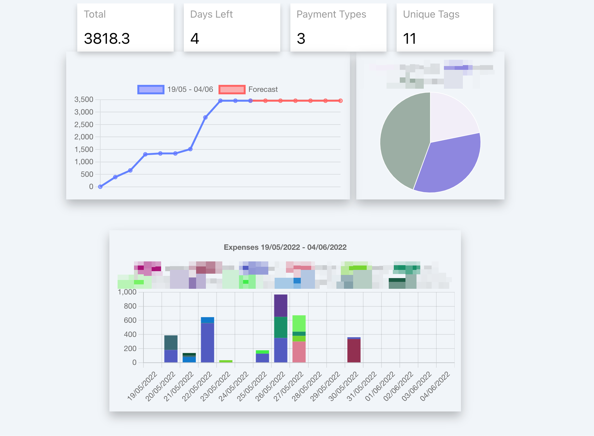
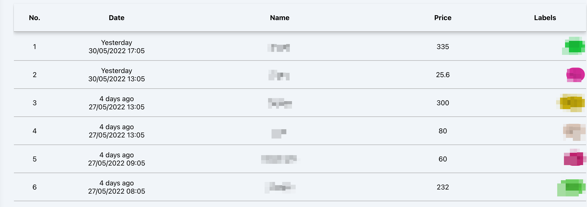

# Bizbuzim

There are so many expenses in life, and it's not easy to keep track of them. Especially when you're on the go, it's difficult to know how much money you've spent. Bizbuzim tracks your expenses while you're doing what's important for you.
Using chatbot technology, we'll automatically calculate your monthly expenses and tell you exactly how much money you've spent.

Bizbuzim is a family-oriented expense management app that helps you quickly find and search their expenses or learn about their your trends. With features such as an expense time tracking, per-person tracking and insights, Bizbuzim makes it easy to save money and manage your expenses better.

More features that will come soon:

1. Recurring expenses - automatically add expenses for your montly/weekly payments.
2. Future expenses - plan ahead your expenses and see how it affects you.
3. Budgets - define budgets and get alerts when 50%\75%\90% of usage.

